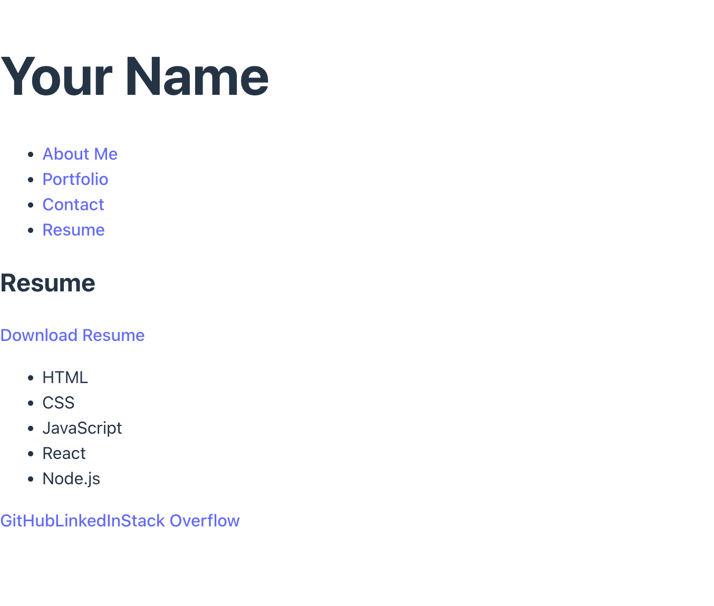

# 🚀 React Developer Portfolio

Welcome to my professional portfolio! Built with **React**, this single-page application showcases my web development projects, skills, and contact information.

## 🧠 Description

This project is a responsive, mobile-first developer portfolio created using React and React Router. It includes sections for About Me, Portfolio, Contact, and Resume, and is designed to provide potential employers or collaborators with a polished overview of my work.

## 🌐 Live Demo

🔗 [View Deployed Site on Netlify](https://celebrated-pastelito-3107c3.netlify.app/)

## 🖼️ Screenshot



> 📸 Tip: Replace `screenshot.png` with your actual screenshot file inside `/public`.

---

## 🛠 Tech Stack

- React
- React Router DOM
- Vite
- JavaScript (ES6+)
- CSS / Flexbox / Grid
- Netlify (Deployment)

---

## 📦 How to Run Locally

1. Clone the repository:
   ```bash
   git https://github.com/HoekInMountain/PortfolioInReact.git
   cd PortfolioInReact
   npm install
   npm run dev
